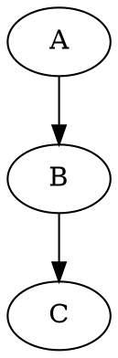
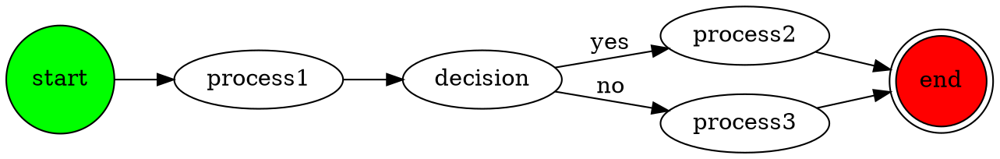
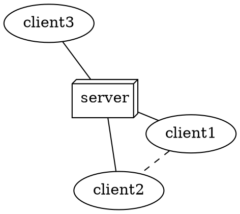
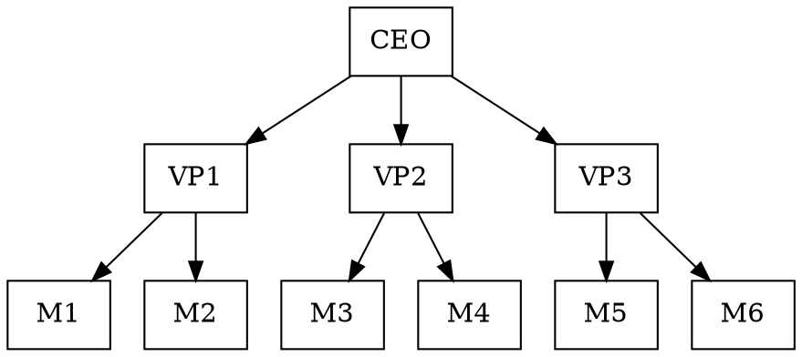
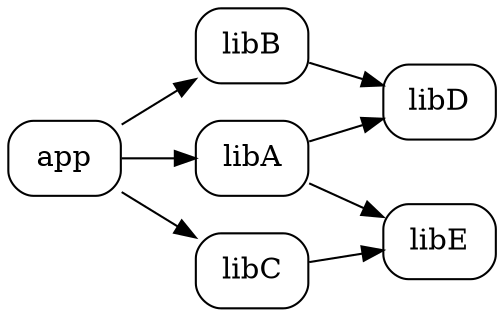
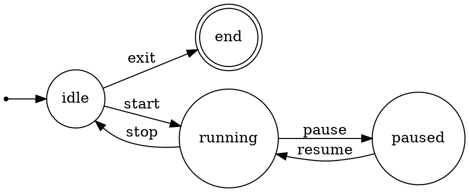
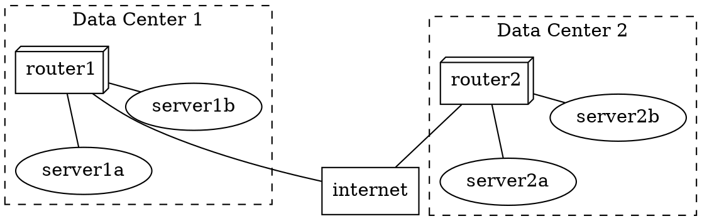
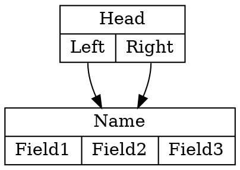
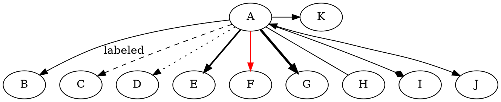
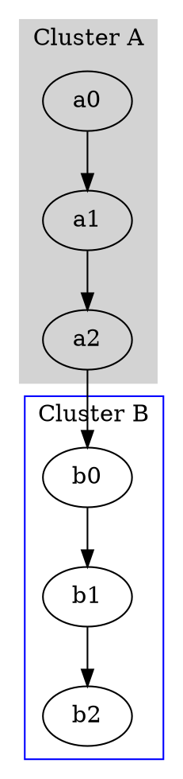

# GraphViz DOT Generation

Generate graph descriptions using DOT language. GraphViz provides powerful automatic layout algorithms for complex graphs.

## Quick Start

Minimal directed graph:


## Output Formats

1. **DOT file** - `.dot` extension for source
2. **Rendered images** - Use Bash to render:
   ```bash
   dot -Tpng graph.dot -o graph.png
   dot -Tsvg graph.dot -o graph.svg
   dot -Tpdf graph.dot -o graph.pdf
   ```

## Workflow

1. **Choose graph type** - `digraph` (directed) or `graph` (undirected)
2. **Define structure** - Nodes and edges
3. **Apply attributes** - Styling and layout hints
4. **Write file** - Save as `.dot`
5. **Render** (optional) - Convert to image format

## Graph Types

### Directed Graph (digraph)


### Undirected Graph (graph)


## Common Patterns

### Hierarchical Layout (Default)


### Dependency Graph


### State Machine


### Network Topology


### Record-Based Nodes (Structs)


## Node Shapes

| Shape | Use Case |
|-------|----------|
| `box` | Process, component |
| `ellipse` | Default, general |
| `circle` | State, small node |
| `doublecircle` | Final state |
| `diamond` | Decision |
| `record` | Data structure |
| `Mrecord` | Rounded record |
| `box3d` | Server, database |
| `cylinder` | Database |
| `folder` | Directory |
| `note` | Comment |
| `tab` | Tab/window |
| `house` | Home/start |
| `invhouse` | Inverted house |
| `polygon` | Custom (sides=N) |
| `point` | Tiny/start point |
| `plaintext` | Text only |

## Edge Attributes



## Subgraphs and Clusters



Note: Subgraphs named `cluster_*` are drawn as boxes.

## Layout Engines

| Engine | Use Case |
|--------|----------|
| `dot` | Hierarchical (default) |
| `neato` | Spring model, undirected |
| `fdp` | Force-directed |
| `sfdp` | Large graph force-directed |
| `circo` | Circular layout |
| `twopi` | Radial layout |

Select via:
```dot
digraph G {
    layout=neato;
    // or use command: neato -Tpng graph.dot -o graph.png
}
```

## Rendering Commands

```bash
# Basic PNG
dot -Tpng input.dot -o output.png

# SVG for web
dot -Tsvg input.dot -o output.svg

# PDF for documents
dot -Tpdf input.dot -o output.pdf

# High-resolution PNG
dot -Tpng -Gdpi=300 input.dot -o output.png

# Using different layout engine
neato -Tpng input.dot -o output.png
fdp -Tpng input.dot -o output.png

# Validate syntax
dot -Tcanon input.dot

# Debug layout
dot -v input.dot
```

## Critical Rules

1. **Semicolons** - Optional but recommended for clarity
2. **Quotes** - Use for labels with spaces/special chars
3. **IDs** - No spaces, or use quotes: `"Node Name"`
4. **Attributes** - In square brackets: `[attr=value]`
5. **Cluster naming** - Must start with `cluster_` to be boxed
6. **Edge syntax** - `->` for digraph, `--` for graph

## When to Use GraphViz

- Complex dependency graphs
- Large graphs with many nodes
- Network topology diagrams
- State machines and automata
- When precise layout control is needed
- When rendering to image files is required
- Hierarchical structures (org charts, trees)
- When automatic layout is preferred over manual

## References

See `references/dot-syntax.md` for complete attribute reference.
See `references/layout-engines.md` for detailed layout engine comparison.
