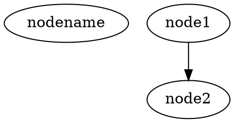
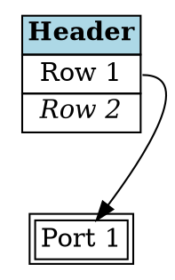
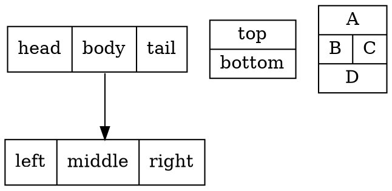
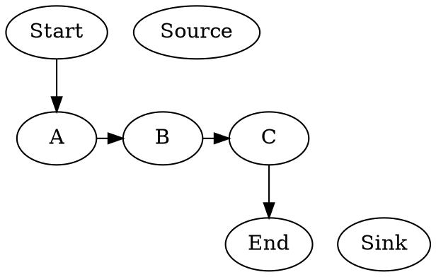
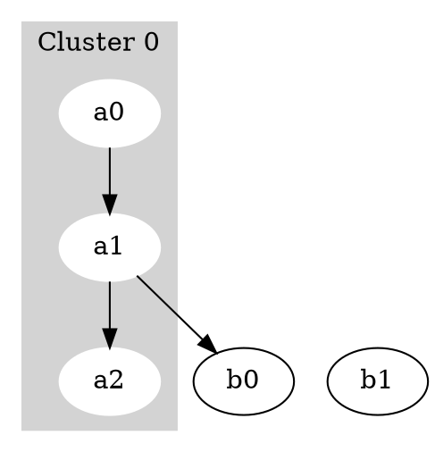
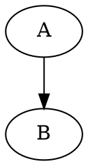
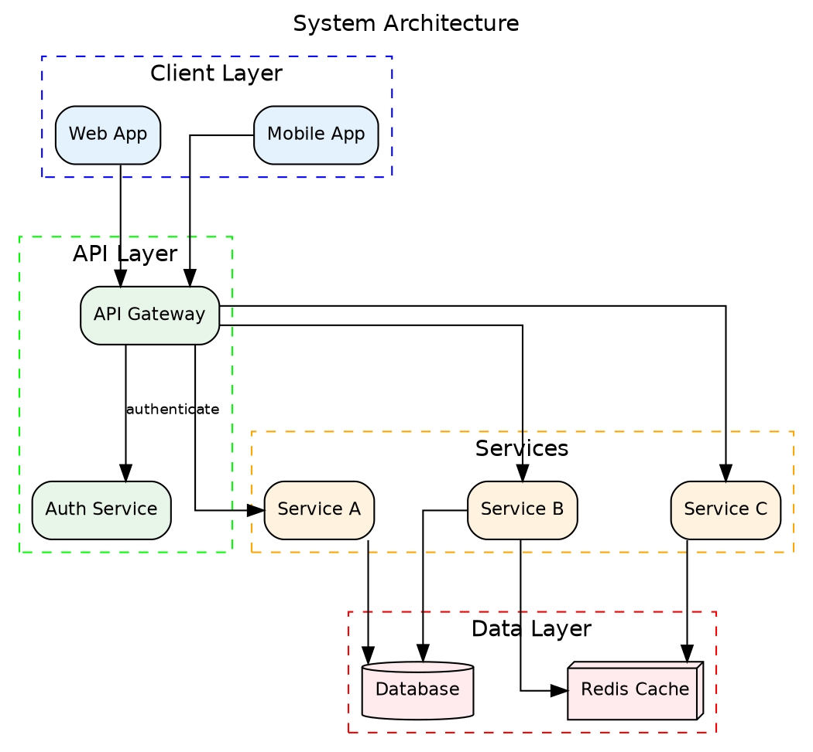

# DOT Language Syntax Reference

Complete attribute reference for GraphViz DOT language.

## Basic Structure



## Graph Attributes

| Attribute | Values | Description |
|-----------|--------|-------------|
| `rankdir` | `TB`, `BT`, `LR`, `RL` | Direction of layout |
| `size` | `"x,y"` | Maximum size in inches |
| `ratio` | `fill`, `compress`, `auto`, float | Aspect ratio |
| `margin` | float or `"x,y"` | Page margin |
| `pad` | float or `"x,y"` | Padding around drawing |
| `bgcolor` | color | Background color |
| `label` | string | Graph label |
| `labelloc` | `t`, `b`, `c` | Label position |
| `labeljust` | `l`, `r`, `c` | Label justification |
| `fontname` | string | Label font |
| `fontsize` | float | Label font size |
| `fontcolor` | color | Label color |
| `compound` | `true`, `false` | Allow edges to clusters |
| `concentrate` | `true`, `false` | Merge edge paths |
| `splines` | `true`, `false`, `ortho`, `polyline`, `curved` | Edge routing |
| `overlap` | `true`, `false`, `scale`, `compress` | Node overlap handling |
| `nodesep` | float | Horizontal node separation |
| `ranksep` | float | Rank separation |
| `dpi` | int | Output resolution |
| `layout` | `dot`, `neato`, `fdp`, etc. | Layout engine |

## Node Attributes

### Shape and Size
| Attribute | Values | Description |
|-----------|--------|-------------|
| `shape` | See shapes table | Node shape |
| `width` | float | Minimum width (inches) |
| `height` | float | Minimum height (inches) |
| `fixedsize` | `true`, `false`, `shape` | Fix dimensions |
| `margin` | float or `"x,y"` | Internal margin |
| `orientation` | float | Shape rotation (degrees) |
| `sides` | int | Polygon sides |
| `skew` | float | Polygon skew |
| `distortion` | float | Polygon distortion |
| `regular` | `true`, `false` | Regular polygon |

### Labels
| Attribute | Values | Description |
|-----------|--------|-------------|
| `label` | string | Node text (HTML allowed) |
| `xlabel` | string | External label |
| `labelloc` | `t`, `b`, `c` | Label position in node |
| `fontname` | string | Font family |
| `fontsize` | float | Font size (points) |
| `fontcolor` | color | Text color |

### Style
| Attribute | Values | Description |
|-----------|--------|-------------|
| `style` | See styles | Drawing style |
| `color` | color | Border color |
| `fillcolor` | color or `"c1:c2"` | Fill color (gradient) |
| `penwidth` | float | Border width |
| `peripheries` | int | Number of borders |

### Behavior
| Attribute | Values | Description |
|-----------|--------|-------------|
| `group` | string | Grouping hint |
| `rank` | `same`, `min`, `max`, `source`, `sink` | Rank constraint |
| `URL` | string | Clickable link |
| `tooltip` | string | Hover text |
| `target` | string | Link target |

## All Node Shapes

### Polygon-Based
```
box, rect, rectangle
square
polygon (with sides=N)
triangle, invtriangle
diamond
trapezium, invtrapezium
parallelogram
house, invhouse
pentagon, hexagon, septagon, octagon
```

### Ellipse-Based
```
ellipse, oval
circle
doublecircle
point
```

### Record-Based
```
record          Rectangular compartments
Mrecord         Rounded record
```

### Special Shapes
```
plaintext       Text only, no border
plain           Alias for plaintext
none            Invisible
underline       Underlined text
note            Note paper
tab             Tab/folder
folder          Folder icon
box3d           3D box
component       UML component
promoter        DNA promoter
cds             Coding sequence
terminator      DNA terminator
utr             Untranslated region
primersite      Primer binding site
restrictionsite Restriction site
fivepoverhang   5' overhang
threepoverhang  3' overhang
noverhang       No overhang
assembly        DNA assembly
signature       Signature
insulator       Insulator
ribosite        Ribosome binding site
rnastab         RNA stability
proteasesite    Protease site
proteinstab     Protein stability
rpromoter       Right promoter
rarrow, larrow  Arrow shapes
lpromoter       Left promoter
star            Star shape
cylinder        Database/cylinder
```

## Edge Attributes

### Appearance
| Attribute | Values | Description |
|-----------|--------|-------------|
| `style` | `solid`, `dashed`, `dotted`, `bold`, `invis` | Line style |
| `color` | color or `"c1:c2:..."` | Edge color(s) |
| `penwidth` | float | Line width |
| `weight` | float | Layout importance |

### Arrows
| Attribute | Values | Description |
|-----------|--------|-------------|
| `arrowhead` | arrow type | End arrow |
| `arrowtail` | arrow type | Start arrow |
| `arrowsize` | float | Arrow scale |
| `dir` | `forward`, `back`, `both`, `none` | Arrow direction |

### Arrow Types
```
normal, inv
dot, odot
invdot, invodot
none
tee
empty
diamond, odiamond
ediamond
box, obox
open
halfopen
crow
vee
```

Arrow modifiers:
```
l or r prefix: Left/right half (e.g., lnormal)
o prefix: Open/hollow (e.g., odiamond)
```

### Labels
| Attribute | Values | Description |
|-----------|--------|-------------|
| `label` | string | Edge label |
| `xlabel` | string | External label |
| `headlabel` | string | Label near head |
| `taillabel` | string | Label near tail |
| `labelfontname` | string | Label font |
| `labelfontsize` | float | Label font size |
| `labelfontcolor` | color | Label color |
| `labeldistance` | float | Label distance |
| `labelangle` | float | Label angle |
| `decorate` | `true`, `false` | Draw line to label |

### Layout
| Attribute | Values | Description |
|-----------|--------|-------------|
| `constraint` | `true`, `false` | Affect ranking |
| `minlen` | int | Minimum edge length |
| `headport` | port | Head connection point |
| `tailport` | port | Tail connection point |
| `samehead` | string | Share head point |
| `sametail` | string | Share tail point |

### Ports
```
n, ne, e, se, s, sw, w, nw, c
:port_name (for record nodes)
```

## Style Values

```
solid           Default
dashed          Dashed line
dotted          Dotted line
bold            Thicker line
invis           Invisible
filled          Filled shape (nodes)
striped         Striped fill
wedged          Pie-slice fill
diagonals       Diagonal fill pattern
rounded         Rounded corners
radial          Radial gradient fill
```

Multiple styles: `style="filled,rounded,bold"`

## Colors

### Named Colors
```
black, white, red, green, blue, yellow
cyan, magenta, orange, purple, pink
gray, grey, darkgray, lightgray
navy, teal, olive, maroon, silver
```

### Color Formats
```
colorname           Named color
"#RRGGBB"          Hex RGB
"#RRGGBBAA"        Hex RGBA
"H S V"            HSV (0-1 range)
"/colorscheme/N"   Color scheme index
```

### Color Schemes
```
X11 colors (default)
SVG colors
Brewer color schemes: /accent3/1, /blues9/5, etc.
```

## HTML-Like Labels



### HTML Tags Supported
```
<B>             Bold
<I>             Italic
<U>             Underline
<O>             Overline
<S>             Strikethrough
<SUB>           Subscript
<SUP>           Superscript
<BR/>           Line break
<FONT>          Font settings
<TABLE>         Table
<TR>            Table row
<TD>            Table cell
<HR/>           Horizontal rule
<VR/>           Vertical rule
          Image
```

## Record Labels



Syntax:
- `|` separates fields horizontally
- `{ }` groups vertically
- `<port>` defines connection point
- `\l` left-align, `\r` right-align, `\n` newline

## Rank Constraints



## Subgraphs and Clusters



## Comments



## Complete Example


