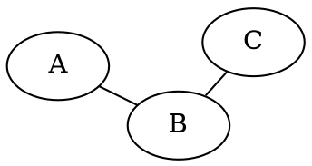

# GraphViz Layout Engines Reference

Detailed comparison and usage guide for GraphViz layout algorithms.

## Engine Overview

| Engine | Type | Best For |
|--------|------|----------|
| `dot` | Hierarchical | DAGs, trees, flowcharts |
| `neato` | Spring model | Small undirected graphs |
| `fdp` | Force-directed | Undirected graphs, clusters |
| `sfdp` | Scalable force-directed | Large undirected graphs |
| `circo` | Circular | Cyclic structures, rings |
| `twopi` | Radial | Root-centered trees |
| `patchwork` | Squarified treemap | Hierarchical data |
| `osage` | Array-based | Recursive clusters |

## dot - Hierarchical Layout

Default engine for directed graphs. Creates layered layouts.

### Best For
- Flowcharts
- Dependency graphs
- Trees and hierarchies
- State machines
- Call graphs

### Key Attributes


### Rank Control


### Example


### Command
```bash
dot -Tpng input.dot -o output.png
```

---

## neato - Spring Model

Uses stress majorization for undirected graphs.

### Best For
- Undirected graphs
- Network diagrams
- Small to medium graphs (<100 nodes)
- When edge length matters

### Key Attributes


### Edge Length Control


### Example


### Command
```bash
neato -Tpng input.dot -o output.png
# or: dot -Kneato -Tpng input.dot -o output.png
```

---

## fdp - Force-Directed Placement

Spring model with multi-scale approach. Better cluster support than neato.

### Best For
- Undirected graphs with clusters
- Medium-sized graphs
- When natural clustering is important

### Key Attributes


### Cluster Support


### Example


### Command
```bash
fdp -Tpng input.dot -o output.png
```

---

## sfdp - Scalable Force-Directed

Optimized for large graphs (1000+ nodes).

### Best For
- Large graphs
- Social networks
- Web graphs
- When fdp is too slow

### Key Attributes
```dot
graph G {
    graph [
        layout=sfdp,
        overlap=prism,   // Best overlap removal
        overlap_scaling=-3,
        splines=true,
        K=2              // Edge length scale
    ];
}
```

### Example


### Command
```bash
sfdp -Tpng input.dot -o output.png
```

---

## circo - Circular Layout

Arranges nodes in a circle.

### Best For
- Cyclic graphs
- Ring topologies
- Circular dependencies
- Round-robin relationships

### Key Attributes


### Example


### Command
```bash
circo -Tpng input.dot -o output.png
```

---

## twopi - Radial Layout

Nodes placed in concentric circles around a root.

### Best For
- Trees with central root
- Organizational hierarchies viewed radially
- Network with central server

### Key Attributes


### Example


### Command
```bash
twopi -Tpng input.dot -o output.png
```

---

## patchwork - Treemap Layout

Squarified treemap for hierarchical data.

### Best For
- Showing proportional sizes
- Disk usage visualization
- Portfolio allocation

### Example


---

## osage - Recursive Cluster Packing

Pack clusters recursively.

### Best For
- Visualizing nested structures
- Organizational layouts

### Example


---

## Choosing the Right Engine

```
START
  |
  v
Is the graph directed with hierarchy?
  |-- Yes --> Use DOT
  |
  No
  |
  v
Is it a circular/ring structure?
  |-- Yes --> Use CIRCO
  |
  No
  |
  v
Is there a central root node?
  |-- Yes --> Use TWOPI
  |
  No
  |
  v
Does the graph have clusters?
  |-- Yes --> Use FDP
  |
  No
  |
  v
Is the graph large (>1000 nodes)?
  |-- Yes --> Use SFDP
  |
  No
  |
  v
Use NEATO (general spring model)
```

## Command-Line Usage

### Basic Rendering
```bash
# Using engine name as command
dot -Tpng graph.dot -o output.png
neato -Tpng graph.dot -o output.png
fdp -Tpng graph.dot -o output.png

# Using -K flag with dot
dot -Kneato -Tpng graph.dot -o output.png
dot -Kfdp -Tpng graph.dot -o output.png
```

### Common Options
```bash
-T<format>     Output format (png, svg, pdf, ps, eps)
-o <file>      Output file
-G<attr>=<val> Set graph attribute
-N<attr>=<val> Set default node attribute
-E<attr>=<val> Set default edge attribute
-Gdpi=300      Set resolution
-v             Verbose output
```

### Batch Processing
```bash
# Convert all .dot files to PNG
for f in *.dot; do
    dot -Tpng "$f" -o "${f%.dot}.png"
done

# Try different layouts
for engine in dot neato fdp circo twopi; do
    $engine -Tpng graph.dot -o "graph_$engine.png"
done
```

## Performance Tips

1. **Large graphs**: Use sfdp instead of neato/fdp
2. **Overlap**: Use `overlap=prism` for best results
3. **Splines**: Set `splines=false` for faster rendering
4. **Simplify**: Remove unnecessary attributes during development
5. **Clusters**: fdp handles clusters better than neato
