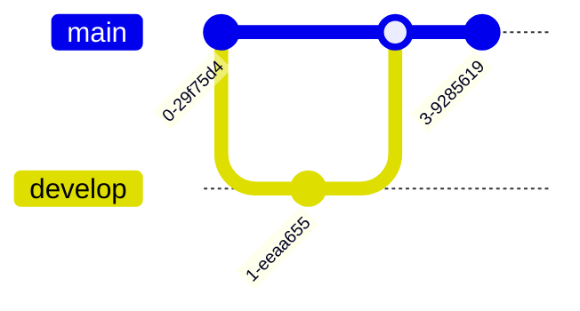

# Mermaid Diagram Generation

Generate text-based diagrams using Mermaid syntax. Mermaid diagrams render directly in GitHub, GitLab, Notion, and many markdown viewers.

## Quick Start

Minimal flowchart:


## Output Formats

1. **Markdown code block** - Embed in `.md` files:
   ````markdown
   ```mermaid
   flowchart TD
       A --> B
   ```
   ````

2. **Standalone file** - `.mmd` or `.mermaid` extension:
   ```
   flowchart TD
       A --> B
   ```

## Workflow

1. **Identify diagram type** - Match user intent to diagram type
2. **Plan structure** - List nodes/entities and relationships
3. **Generate syntax** - Write Mermaid code following type-specific patterns
4. **Output** - Write to file or embed in markdown

## Diagram Types Overview

### Flowchart
Direction: `TD` (top-down), `LR` (left-right), `BT`, `RL`


### Sequence Diagram


### Class Diagram


### Entity Relationship (ER)


### State Diagram


### Gantt Chart


### Pie Chart


### Mindmap


### Timeline


### Git Graph


## Node Shapes (Flowchart)

| Shape | Syntax | Use For |
|-------|--------|---------|
| Rectangle | `[text]` | Process/action |
| Rounded | `(text)` | Start/end |
| Stadium | `([text])` | Terminal |
| Subroutine | `[[text]]` | Subprocess |
| Database | `[(text)]` | Data store |
| Circle | `((text))` | Connector |
| Diamond | `{text}` | Decision |
| Hexagon | `{{text}}` | Preparation |
| Parallelogram | `[/text/]` | Input/Output |
| Trapezoid | `[/text\]` | Manual operation |

## Arrow Types

| Arrow | Syntax | Meaning |
|-------|--------|---------|
| Solid | `-->` | Flow |
| Dotted | `-.->` | Optional/async |
| Thick | `==>` | Important |
| With text | `-->|label|` | Labeled flow |
| Open | `---` | Association |

## Styling

### Inline styling


### Theme configuration


Available themes: `default`, `forest`, `dark`, `neutral`, `base`

## Critical Rules

1. **Indentation** - Use consistent 4-space indentation
2. **Node IDs** - Use short, unique identifiers (A, B, node1)
3. **Special characters** - Wrap text with special chars in quotes: `A["Text with (parens)"]`
4. **Subgraphs** - Close with `end` keyword
5. **No trailing whitespace** - Can cause parsing issues

## Subgraphs (Flowchart)


## When to Use Mermaid

- Documentation in markdown files
- README diagrams (GitHub/GitLab render natively)
- Sequence diagrams for API flows
- Class diagrams for OOP design
- ER diagrams for database schema
- Gantt charts for project planning
- Quick diagrams that don't need precise positioning

## References

See `references/diagram-types.md` for complete examples of each diagram type.
See `references/syntax-reference.md` for detailed syntax and configuration options.
