# Mermaid Diagram Types Reference

Complete examples for all Mermaid diagram types.

## Flowchart

### Basic Flowchart
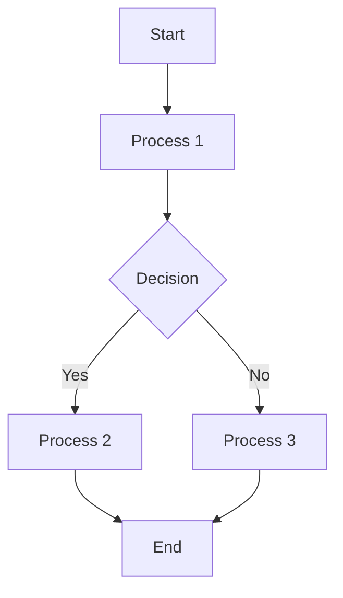

### Horizontal Flowchart
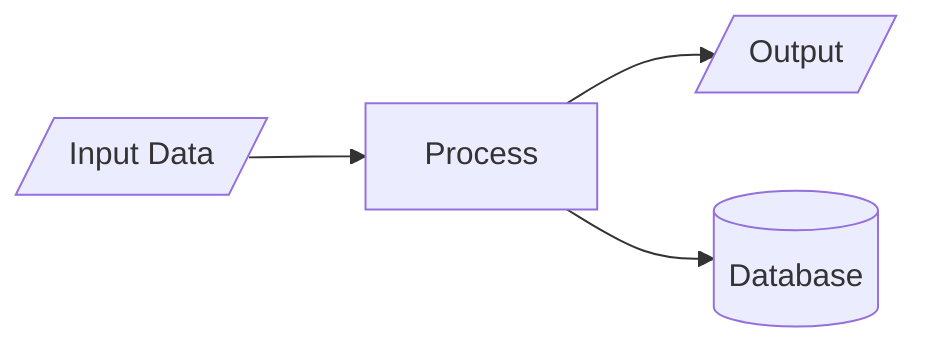

### Complex Flowchart with Subgraphs
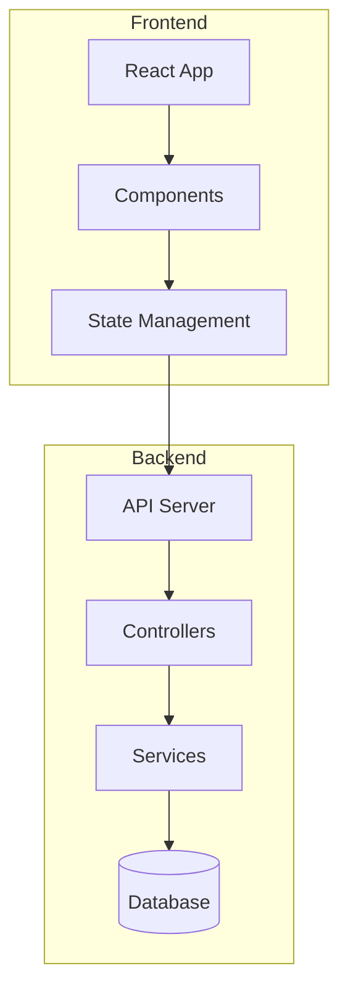

### All Node Shapes
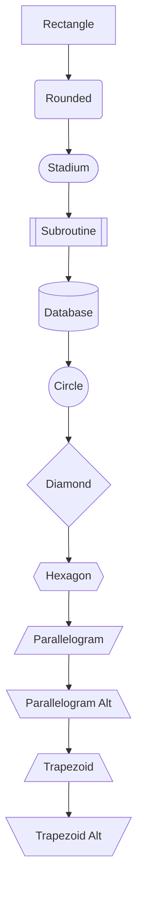

### All Arrow Types
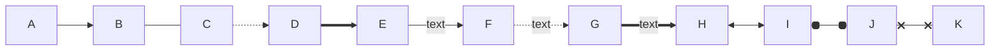

## Sequence Diagram

### Basic Sequence
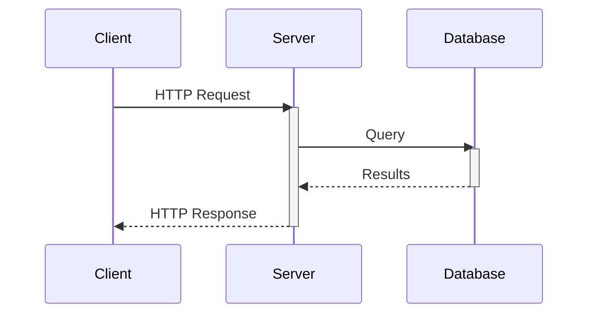

### With Loops and Alternatives
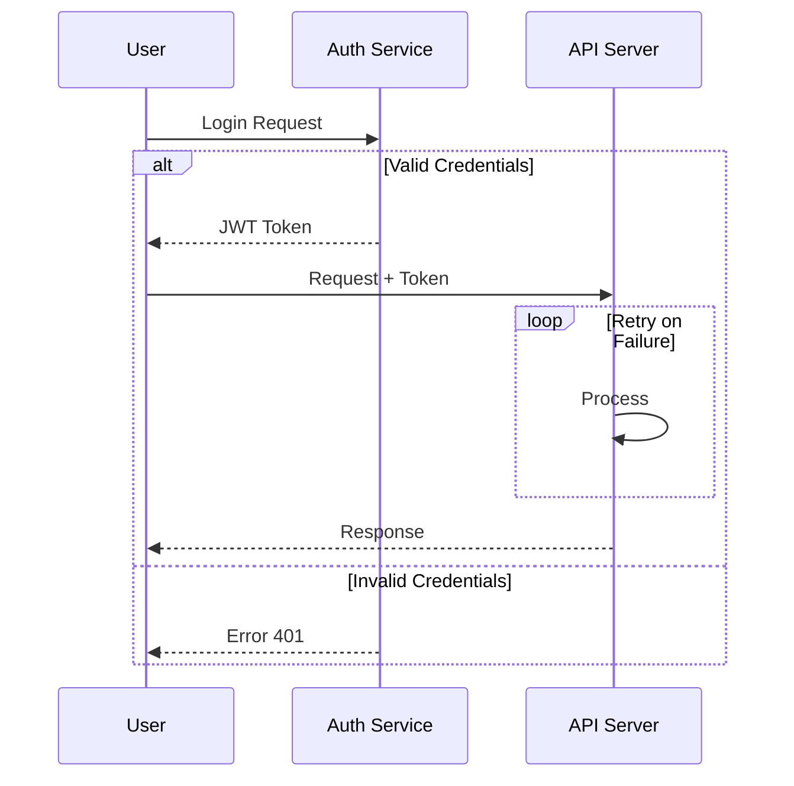

### With Notes and Participants
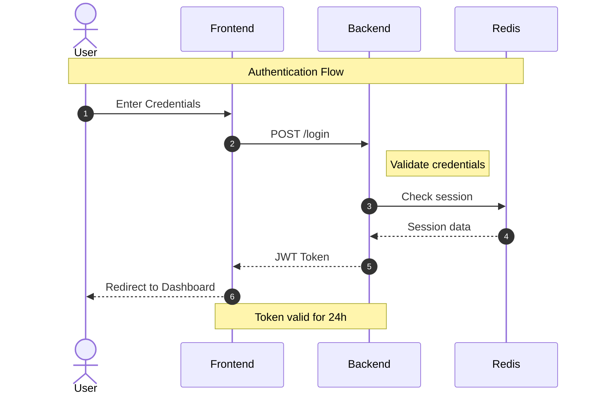

## Class Diagram

### Basic Class Diagram
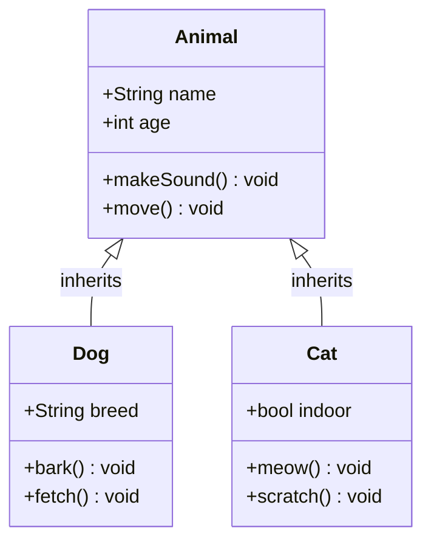

### With Relationships
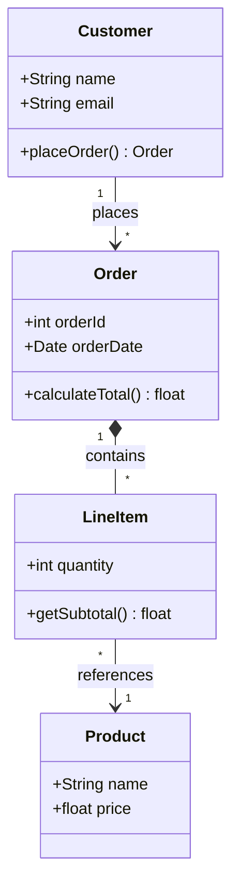

### Relationship Types
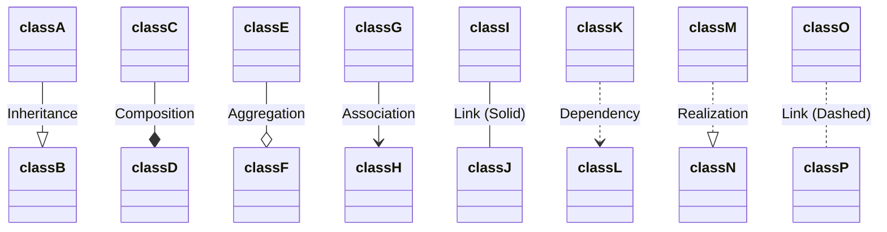

## Entity Relationship Diagram

### Database Schema
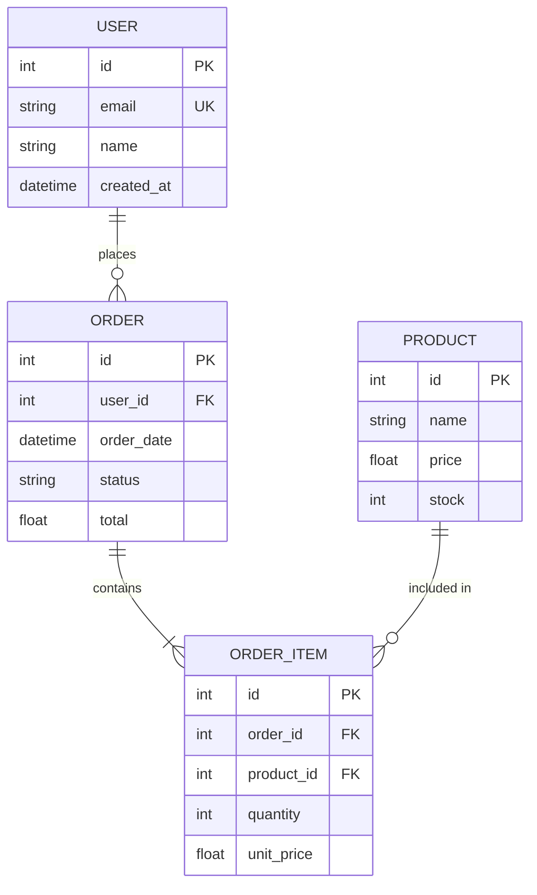

### Cardinality Notation
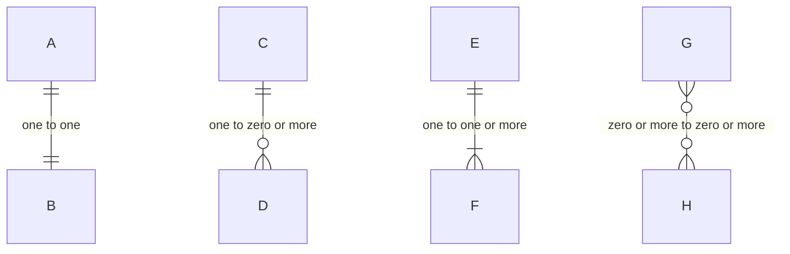

## State Diagram

### Basic State Machine
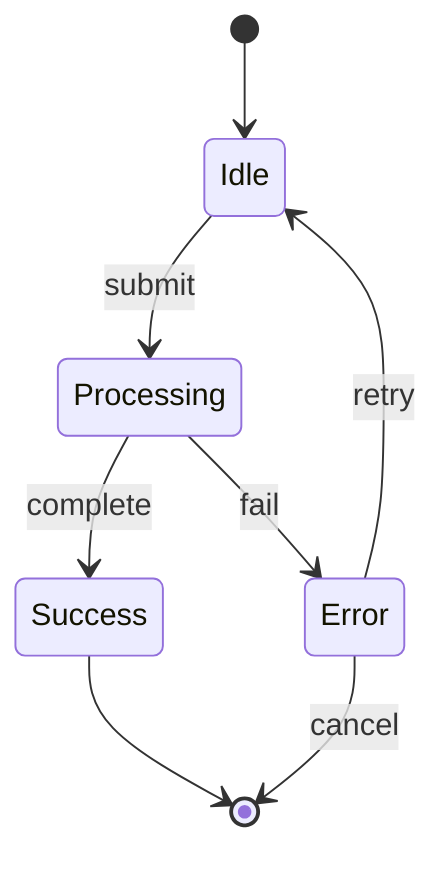

### With Composite States
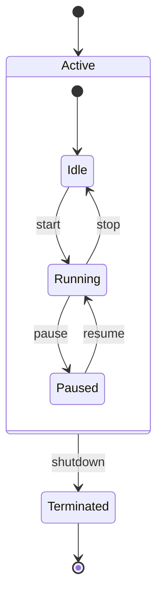

### With Forks and Joins
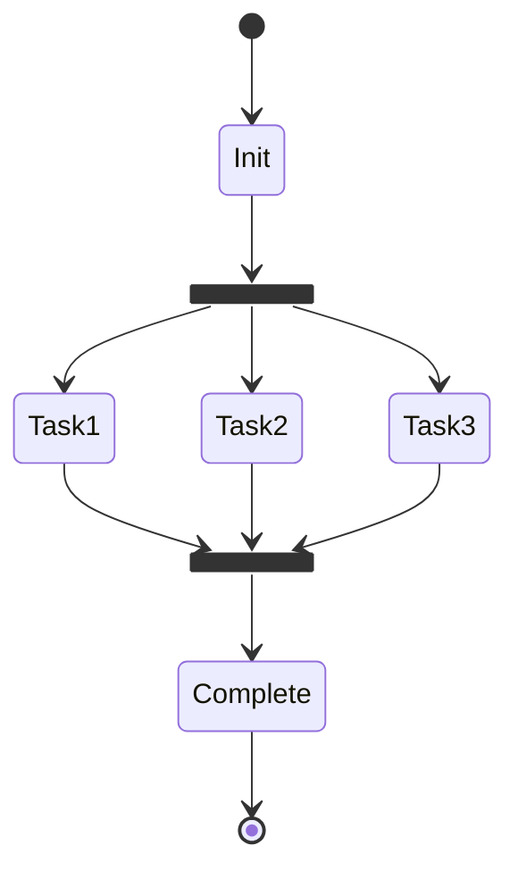

## Gantt Chart

### Project Timeline
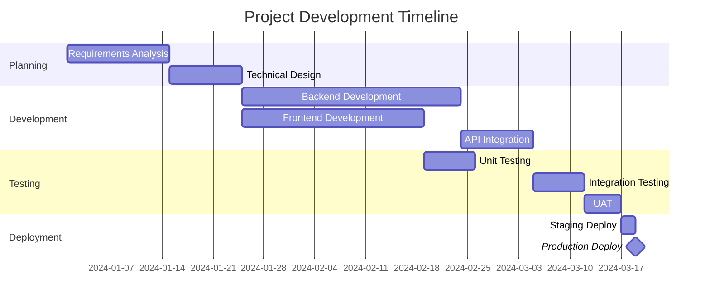

### With Task States
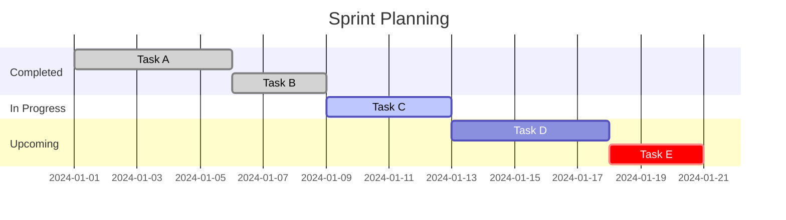

## Pie Chart

### Simple Distribution
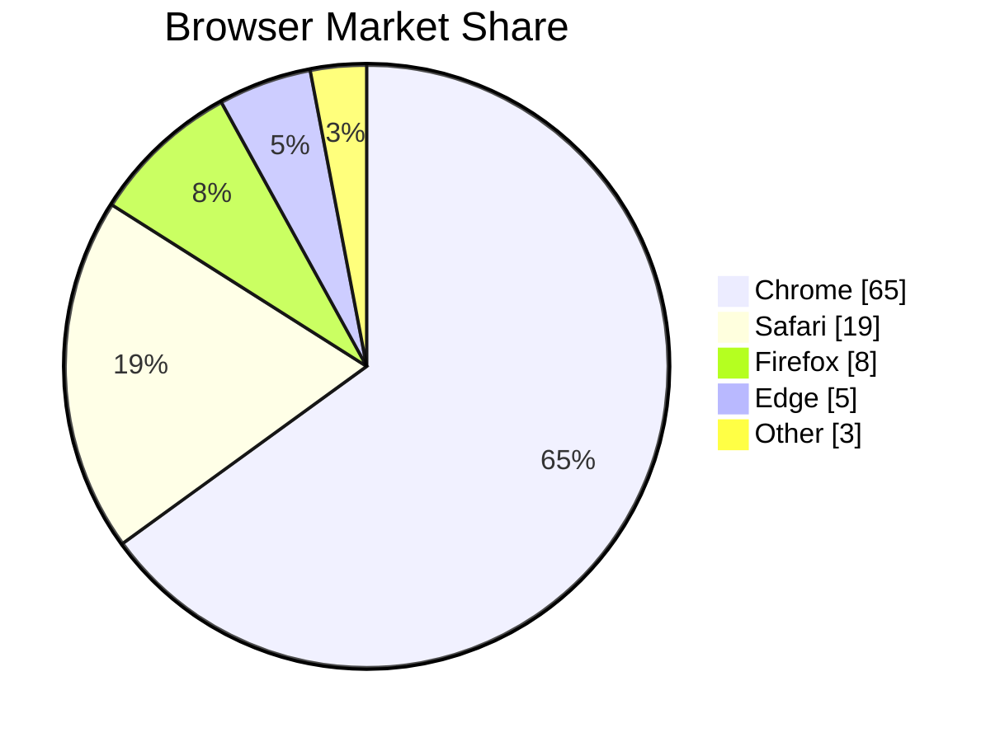

## Mindmap

### Hierarchical Ideas
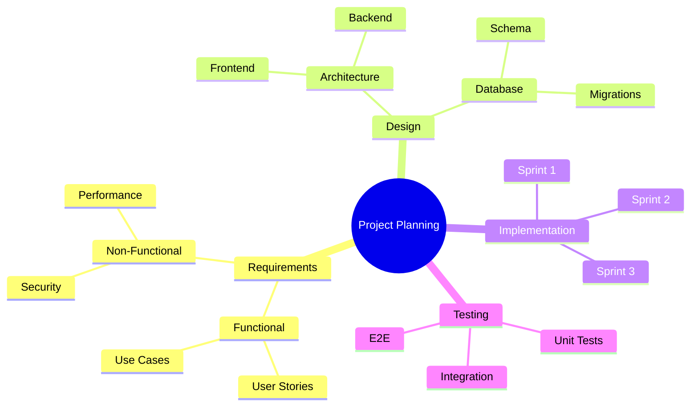

## Timeline

### Historical Events
```mermaid
timeline
    title Company History
    section Founding
        2018 : Company founded
             : Initial funding round
    section Growth
        2019 : Series A
             : 50 employees
        2020 : International expansion
        2021 : Series B
             : 200 employees
    section Present
        2022 : IPO
        2023 : Acquisitions
```

## Git Graph

### Branch Management
```mermaid
gitGraph
    commit id: "Initial"
    branch develop
    checkout develop
    commit id: "Feature A start"
    commit id: "Feature A complete"
    checkout main
    merge develop id: "Merge Feature A"

    branch feature-b
    checkout feature-b
    commit id: "Feature B start"

    checkout develop
    commit id: "Hotfix"

    checkout feature-b
    commit id: "Feature B complete"

    checkout develop
    merge feature-b id: "Merge Feature B"

    checkout main
    merge develop id: "Release v1.0" tag: "v1.0"
```

## Quadrant Chart

### Priority Matrix
```mermaid
quadrantChart
    title Priority Matrix
    x-axis Low Effort --> High Effort
    y-axis Low Impact --> High Impact
    quadrant-1 Do First
    quadrant-2 Schedule
    quadrant-3 Delegate
    quadrant-4 Eliminate

    Task A: [0.8, 0.9]
    Task B: [0.2, 0.8]
    Task C: [0.7, 0.3]
    Task D: [0.3, 0.2]
```
