# Mermaid Syntax Reference

Comprehensive syntax guide for Mermaid diagrams.

## Configuration and Directives

### Init Directive
Configure diagram settings at the start:
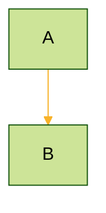

### Available Themes
- `default` - Standard Mermaid colors
- `forest` - Green/nature tones
- `dark` - Dark mode
- `neutral` - Grayscale
- `base` - Minimal styling for customization

## Flowchart Syntax

### Directions
| Direction | Meaning |
|-----------|---------|
| `TB` or `TD` | Top to Bottom |
| `BT` | Bottom to Top |
| `LR` | Left to Right |
| `RL` | Right to Left |

### Node Definitions
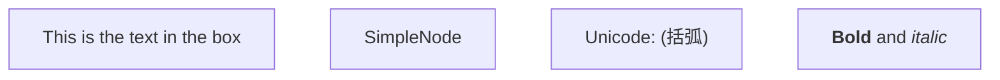

### All Node Shapes Reference
```
[text]      Rectangle (default)
(text)      Rounded rectangle
([text])    Stadium shape
[[text]]    Subroutine
[(text)]    Cylindrical (database)
((text))    Circle
>text]      Asymmetric/flag
{text}      Diamond/rhombus
{{text}}    Hexagon
[/text/]    Parallelogram
[\text\]    Parallelogram (alt)
[/text\]    Trapezoid
[\text/]    Trapezoid (alt)
(((text)))  Double circle
```

### Link/Arrow Styles
```
A --> B     Arrow
A --- B     Line
A -.-> B    Dotted arrow
A -.- B     Dotted line
A ==> B     Thick arrow
A === B     Thick line
A --o B     Circle end
A --x B     Cross end
A o--o B    Circles both ends
A <--> B    Arrows both ends
A -- text --> B    With label
A -->|text| B      With label (alt)
```

### Link Length
```
A --> B         Normal
A ---> B        Longer
A ----> B       Even longer
A -.-> B        Dotted
A -.-.-> B      Longer dotted
A ==> B         Thick
A ===> B        Longer thick
```

### Subgraphs
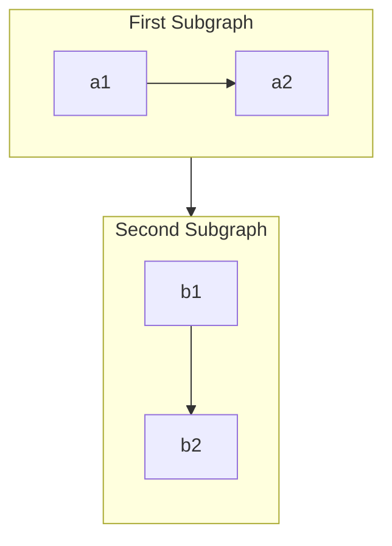

### Styling

#### Class Definitions
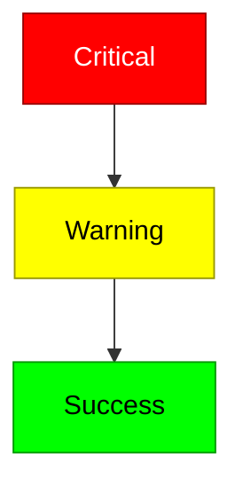

#### Inline Styles
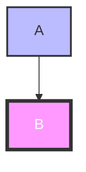

#### Link Styling
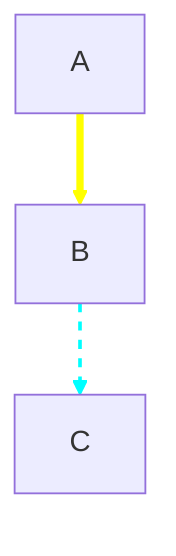

## Sequence Diagram Syntax

### Participants
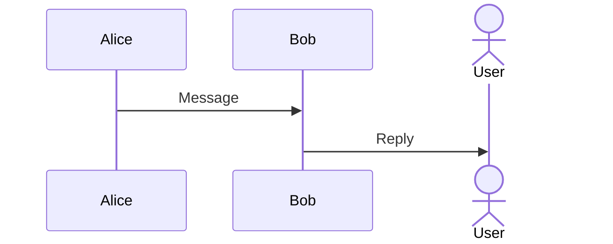

### Message Types
```
->>     Solid line with arrowhead
-->>    Dotted line with arrowhead
--)     Solid line with open arrowhead
--)     Dotted line with open arrowhead
-x      Solid line with cross
--x     Dotted line with cross
```

### Activation
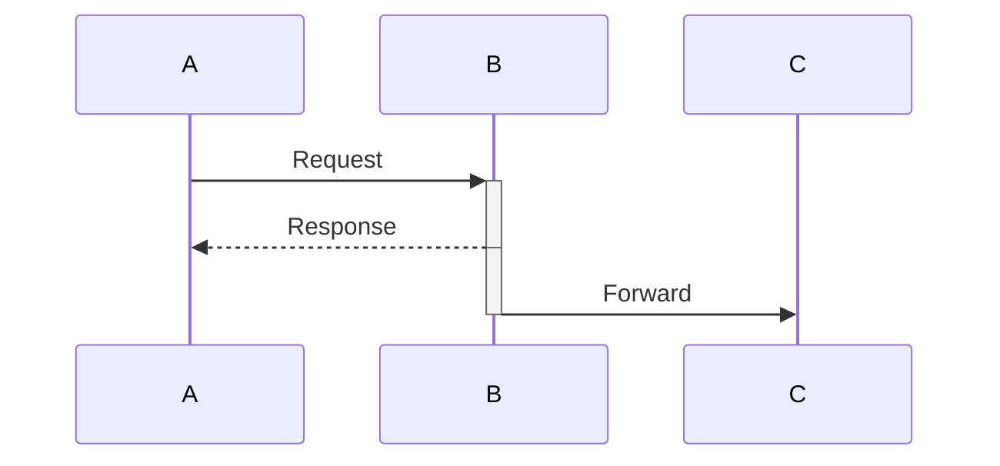

### Notes
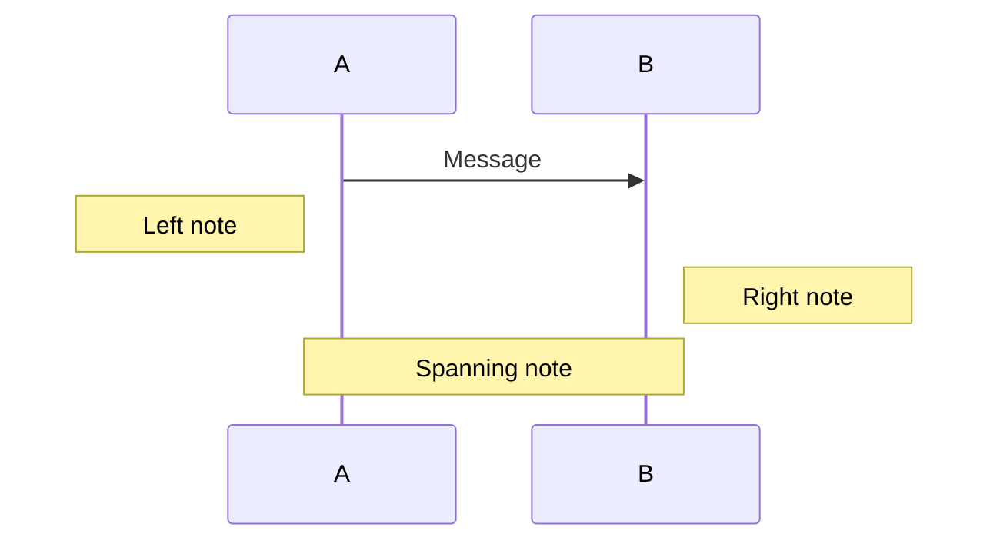

### Loops and Conditionals
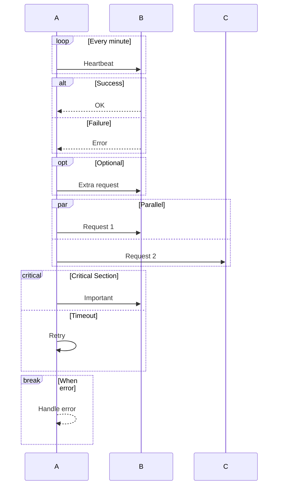

### Auto-numbering
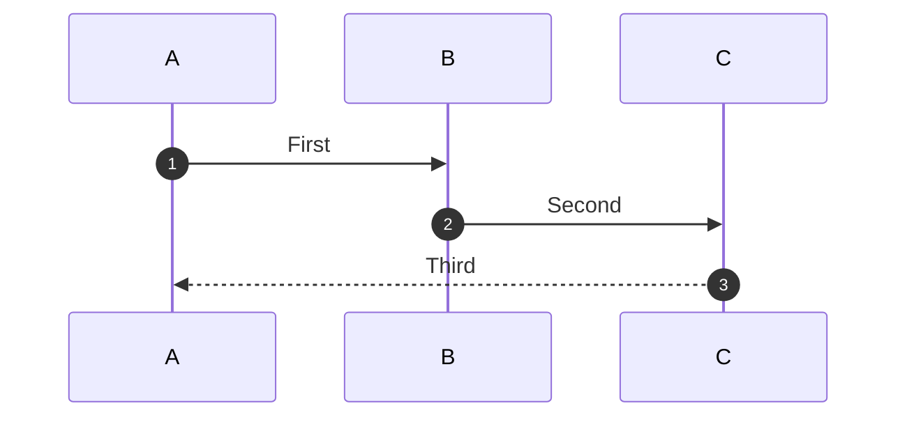

## Class Diagram Syntax

### Class Definition
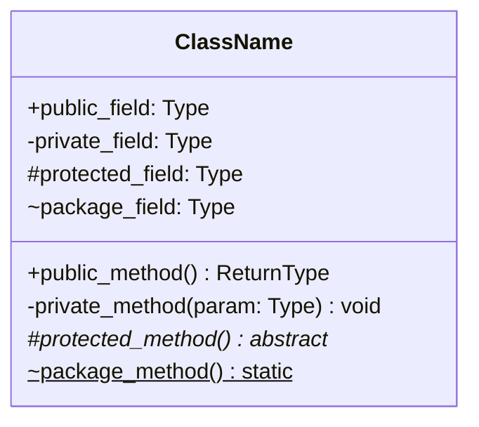

### Visibility Modifiers
| Symbol | Meaning |
|--------|---------|
| `+` | Public |
| `-` | Private |
| `#` | Protected |
| `~` | Package/Internal |

### Method Modifiers
| Symbol | Meaning |
|--------|---------|
| `*` | Abstract |
| `$` | Static |

### Relationships
```
<|--    Inheritance
*--     Composition
o--     Aggregation
-->     Association
--      Link (solid)
..>     Dependency
..|>    Realization
..      Link (dashed)
```

### Cardinality
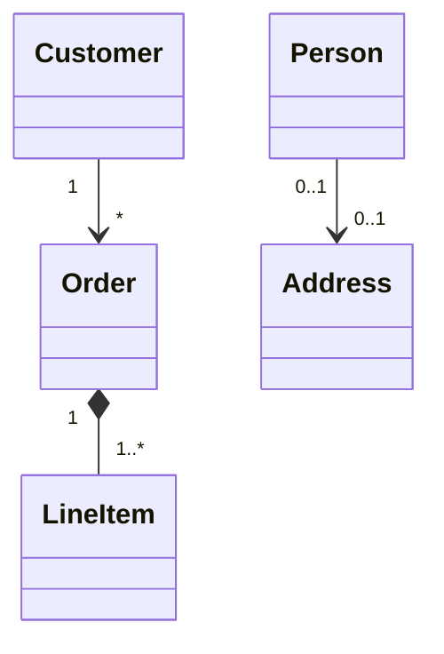

### Annotations
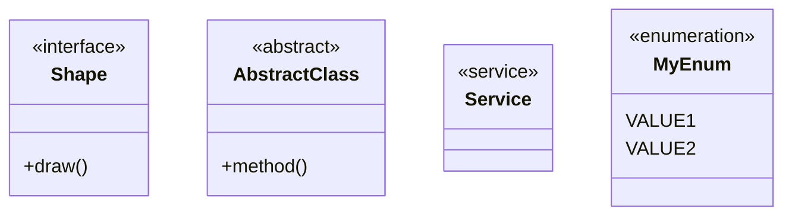

## ER Diagram Syntax

### Entity Definition
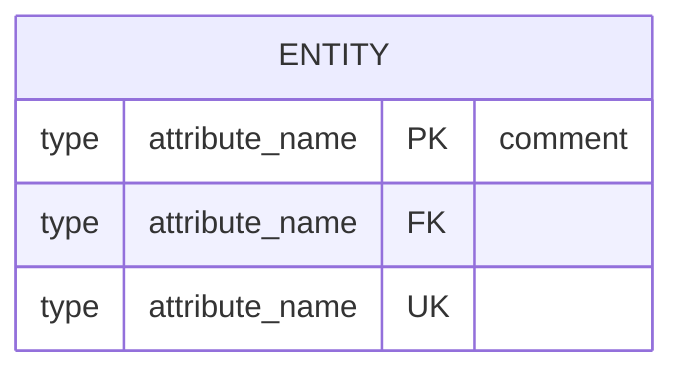

### Key Types
| Notation | Meaning |
|----------|---------|
| `PK` | Primary Key |
| `FK` | Foreign Key |
| `UK` | Unique Key |

### Relationship Cardinality
| Value | Meaning |
|-------|---------|
| `\|o` | Zero or one |
| `\|\|` | Exactly one |
| `}o` | Zero or more |
| `}\|` | One or more |

### Relationship Syntax
```
||--||    One to one
||--o{    One to zero or more
||--|{    One to one or more
}o--o{    Zero or more to zero or more
```

## State Diagram Syntax

### Basic States
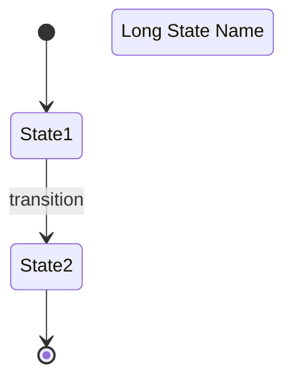

### Composite States
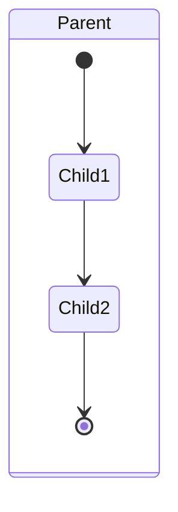

### Special States


### Notes
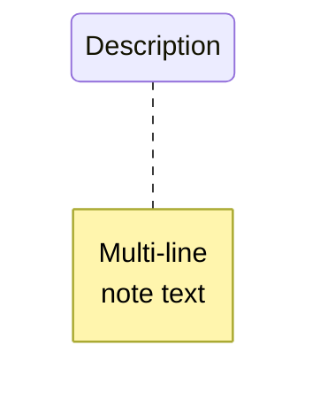

## Gantt Chart Syntax

### Task Definition
```
taskname :tag, start_date, duration
taskname :tag, after dependency, duration
taskname :done, 2024-01-01, 5d
taskname :active, after task1, 3d
taskname :crit, 2024-01-10, 1d
taskname :milestone, after task2, 0d
```

### Task States
| State | Meaning |
|-------|---------|
| `done` | Completed |
| `active` | In progress |
| `crit` | Critical path |
| (none) | Upcoming |

### Date Formats
```
dateFormat YYYY-MM-DD
dateFormat DD-MM-YYYY
axisFormat %Y-%m
```

## Comments

All diagram types support comments:
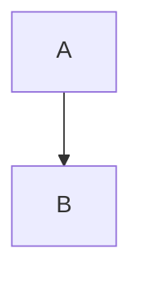

## Escaping Special Characters

```mermaid
flowchart TD
    A["Text with #quot;quotes#quot;"]
    B["Text with #lpar;parens#rpar;"]
    C["Line 1#br;Line 2"]
```

### Escape Sequences
| Sequence | Character |
|----------|-----------|
| `#quot;` | `"` |
| `#lpar;` | `(` |
| `#rpar;` | `)` |
| `#br;` | Line break |
| `#semi;` | `;` |
| `#colon;` | `:` |

## Accessibility

```mermaid
flowchart TD
    accTitle: Chart title for screen readers
    accDescr: Detailed description of the chart

    A --> B
```
